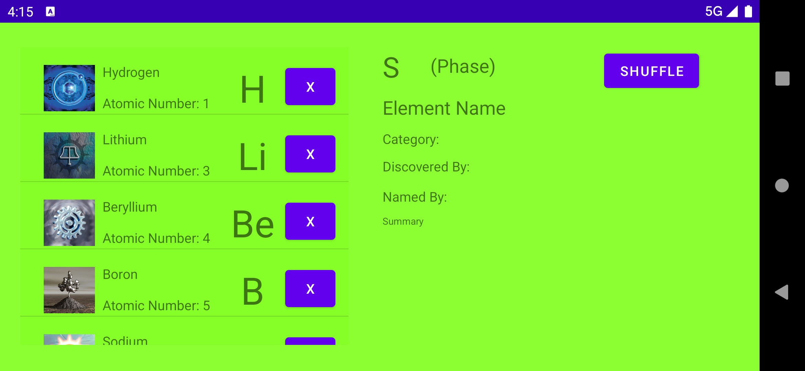

# Android Projects
A compilation of projects completed in my CS Topics: Mobile App Development Class.

Projects Include:
- [Calculator App](https://github.com/prathami1/android-projects#calculator-app)
- [Periodic Table App](https://github.com/prathami1/android-projects#periodic-table-app)
- [Weather App](https://github.com/prathami1/android-projects#weather-app)
- [Geoencoder/Map Visualization App](https://github.com/prathami1/android-projects#geoencoder-map-visualization-app)
- [Panda Punch](https://github.com/prathami1/android-projects#panda-punch)
- [Dodge Game](https://github.com/prathami1/android-projects#dodge-game)
- [Slide Scan](https://github.com/prathami1/slide-scan)

Outlined below are screenshots of the applications mentioned above, showcasing their UI and functionality.

## Calculator App
This project was my first android application, developed in order to showcase my knowledge with basic Java operations (such as parsing text, doing simple math calculations, printing and formatting text, etc). I decided to utilize my knowledge of data structures to store and operate the calculations, helping with the application's efficiency.

### Technologies/Tools Highlighted
- String Tokenizer
- Stacks
- Mathematical Operations

### Application in Action
Below are screenshots of the application in action:

| Application Greeting     | Simple Operations         | Order of Operations       | Special Operations       | Decimal Operations
:-------------------------:|:-------------------------:|:-------------------------:|:-------------------------:|:-------------------------:
  |  |  |  | 

Although the application was not designed for landscape use, it is still functional in that orientation, as illustrated below:

| Landscape Greeting       | Landscape Operations           
:-------------------------:|:-------------------------:
  | 

https://user-images.githubusercontent.com/62070812/147515187-44a810df-bb22-42d2-b128-6fa0e64cb9a3.mov

## Periodic Table App
This project was developed in order to showcase my knowledge with both the ListView module in Android Studio and the Volley module for API requests. After meeting various requirements (such as populating a listview with a certain amount of elements, adding functionality such as images and removing elements to each element of the listview, keeping it's position and listview's population amount after rotation, and showcasing various descriptions and information on each element while selected), I decided to dabble into the realm of API development. Utilizing the expertise from my web-development skills, I developed an [API](https://prathami1.github.io/data/periodic-table/data.json) featuring [Bowserinator](https://github.com/Bowserinator/Periodic-Table-JSON)'s data, and with the use of the Volley module for Android Studio, I was able to populate the listview with my API calls. I also added a shuffle button to spice up the order of the elements in the list. 

An in house API was developed for the project, which can be found [here](https://prathami1.github.io/data/periodic-table/data.json).

### Technologies/Tools Highlighted
- ListView Module
- Volley Module
- Custom API
- JSONObject/JSONArray

### Application in Action
Below are screenshots of the application in action:

| Application Greeting     | Selected Info on Element  | Managing/Deleting Elements| Shuffling Elements
:-------------------------:|:-------------------------:|:-------------------------:|:-------------------------:
  |  |  | 

| Landscape Greeting     | Selected Info on Element    | Managing/Deleting Elements
:-------------------------:|:-------------------------:|:-------------------------:
  |  | 

https://user-images.githubusercontent.com/62070812/148669792-322f233e-b387-4e05-949d-3d9b1bfae2c0.mov

## Weather App
This project was developed in order to showcase my knowledge with API requests (and fetch GET/POST requests for various APIs). Initially, I was required to implement AsyncTask within the application (a severely outdated module that was depricated within Android API V.29), but it was unsupported for development on my M1 Mac (supporting Android API V.30 or higher). Due to this, I decided to utilize my knowledge with the Volley module (from the [Periodic Table App](https://github.com/prathami1/android-projects#periodic-table-app)) and develop the application implementing that dependency instead. 

I utilized the [Open Weathermap API](https://openweathermap.org/api), making 2 seperate API calls: one to translate the inputted zipcode into usable information (longitude and latitude coordinates), and another one to fetch weather data and metadata from the usable information. 

### Technologies/Tools Highlighted
- ListView Module
- Volley Module
- Open Weathermap API
- JSONObject/JSONArray

### Application in Action
Below are screenshots of the application in action:

| Application Greeting     | Example Fetch  | Example Fetch 2 | Example Fetch 3
:-------------------------:|:-------------------------:|:-------------------------:|:-------------------------:
  |  |  | 

https://user-images.githubusercontent.com/62070812/151913739-0aed9a61-f2fb-4682-a63c-426baf43194e.mov

## Geoencoder Map Visualization App
This project was developed in order to familiarize myself with device permissions. Initially, I was required to utilize specific device permissions in order to access the specific latitude and longitude coordinates of a device running the app, and use those coordinates to map out distances from previous locations, time the duration of the distances, and convert those latitude and longitude coordinates into an address. In addition to the requirements, I decided to add a favorite location feature (listing the location where the user spent the most time at), and a MapView in order to visualize the current location of the user. 

### Technologies/Tools Highlighted
- Map View module
- Geocoder
- onRequestPermissions Module

### Screenshots of Application
Coming Soon!

<!-- ### Application in Action
Below are screenshots of the application in action:

| Application Greeting     | Example Location  | Example Location 2 | Example Favorite Location
:-------------------------:|:-------------------------:|:-------------------------:|:-------------------------:
  |  |  |  -->

## Panda Punch
This project was developed in order to showcase my knowledge in complex java operations and their applications, as well as intents. My knowledge of java operations are exemplified through arithmetic in my [Calculator App](https://github.com/prathami1/android-projects#calculator-app), but I decided to put them to practical use in the form of a game. Instructed to develop a game similar to the style of the infamous Whack-A-Mole, I utilized various algorithmic techniques in order to develop a grid of icons (filled with drawables of pandas) ready to be "punched." After ornamenting the program with various embelishments (such as haptic feedback, visual timer effects, a trophy count, and high scores), I developed algorithms to power certain aspects of the game (such as random elements popping up, what each element does, how the score is calculated, etc). 

### Technologies/Tools Highlighted
- ListView Module
- Volley Module
- Open Weathermap API
- JSONObject/JSONArray

### Screenshots of Application
Coming Soon!

<!-- ### Application in Action
Below are screenshots of the application in action:

| Application Greeting     | Example Fetch  | Example Fetch 2 | Example Fetch 3
:-------------------------:|:-------------------------:|:-------------------------:|:-------------------------:
  |  |  |  -->

## Dodge Game
This project was developed in order to develop my skills in leveraging sensors built into most Android devices. Utilizing the Gyroscope, Accelerometer, and other sensors of that nature, I developed a game based purely on rotational input: in order to move in-game elements, one must rotate and reposition their device in order for the respective in-game element to follow. In addition to these foundational additions to the game, I added an embelishment that utilizes the devices speaker: background music. Since I was given an extremely short time-span for this project, its user interface is pretty basic, but has scope for additional themes/skins to be implemented later on.

### Technologies/Tools Highlighted
- ListView Module
- Volley Module
- Open Weathermap API
- JSONObject/JSONArray

### Screenshots of Application
Coming Soon!

<!-- ### Application in Action
Below are screenshots of the application in action:

| Application Greeting     | Example Fetch  | Example Fetch 2 | Example Fetch 3
:-------------------------:|:-------------------------:|:-------------------------:|:-------------------------:
  |  |  |  -->
